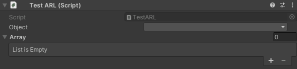

# Editor Utilities
__

## Installation
To install this package you can do one of this:
- Using Package Manager Window
    - Opening the Package Manager Window: Window > Package Manager
    - Wait for it to load
    - Click on the top left button `+` > Add package from git URL
    - Copy paste the [repository link](https://github.com/ErikRikoo/com.rikoo.editor-utilities.git)
    - Press enter

- Modifying manifest.json file
Add the following to your `manifest.json` file (which is under your project location in `Packages` folder)
```json
{
  "dependancies": {
    ...
    "com.rikoo.editor-utilities": "https://github.com/ErikRikoo/com.rikoo.editor-utilities.git",
    ...
  }
}
```

## Updating
Sometimes Unity has some hard time updating git dependencies so when you want to update the package, 
follow this steps:
- Go into `package-lock.json` file (same place that `manifest.json` one)
- It should look like this:
```json
{
  "dependencies": {
    ...
    "com.rikoo.editor-utilities": {
      "version": "https://github.com/ErikRikoo/com.rikoo.editor-utilities.git",
      "depth": 0,
      "source": "git",
      "dependencies": {},
      "hash": "hash-number-there"
    },
    ...
}
```
- Remove the _"com.rikoo.editor-utilities"_ and save the file
- Get back to Unity
- Let him refresh
- Package should be updated

## Contents

### Attributes
<details>
    <summary>Abstract Reference</summary>
    
This attribute is really handy when you want to choose in the Editor which subclass you want. Thus, you can easily go abstract and respect solid principles right into Unity.
Moreover, it works with arrays and with nested AbstractReferences
I will show you how to use it with basic use case: you will have a base class and two subclasses. One will contain a float and the other a string.
````csharp
// The base class
// The serializable attribute is really important
[System.Serializable]
public abstract class ABase {}

// First subclass
[System.Serializable]
public class Implementation1 : ABase
{
    [SerializeField] private float foo;
}

// Second subclass
[System.Serializable]
public class Implementation2 : ABase
{
    [SerializeField] private string foo;
}
````
There the MonoBehaviour to test it:
```csharp
public class Test : UnityEngine.MonoBehaviour
{
    [AbstractReference]
    [SerializeReference] private ABase m_Object;
    
    [AbstractReference]
    [SerializeReference] private ABase[] m_Array;
}
```
On this one you can see, that:
- The type used is the base type and not one of the subclasses.
- We use the SerializeReference attribute, don't forget it.
- We use the custom attribute AbstractReference.

Here the result in the editor:

</details>


## Suggestions
Feel free to suggest features by creating an issue, any idea is welcome !
